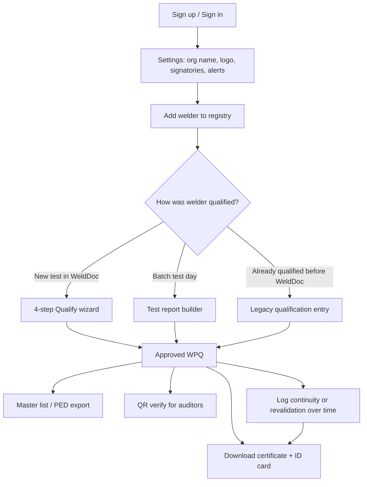
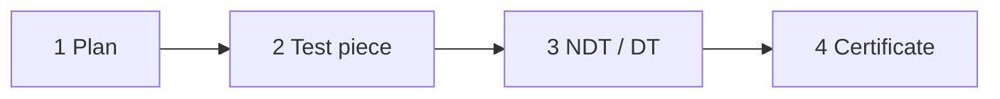

# WeldDoc — Client Guide

**Purpose of this document:** Explain WeldDoc from start to finish so you can walk a client through the product — what each screen does, why it exists, and how it maps to their EN ISO 9606-1 paperwork (welder registry, WQT reports, certificates, master list, PED list, continuity, revalidation).

---

## 1. What WeldDoc is

WeldDoc is a **welder qualification document management system** built for **EN ISO 9606-1:2017**.

It replaces (or sits alongside) spreadsheets and paper folders for:

| Client pain | What WeldDoc does |
|-------------|-------------------|
| Scattered welder records | Central **welder registry** with photo, ID, employer, QR code |
| Manual range-of-approval calculation | **Automatic range engine** from test piece data |
| Typing certificates from scratch | **Certificate PDF** generated from stored qualification data |
| Plant gate / auditor checks | **QR code** on ID card → public verify page (no login) |
| Batch WQT sessions (many welders, one test day) | **Test report builder** → one sheet PDF + one qualification per welder |
| Audit / PED submissions | **Master list** with standard and PED export formats |
| Missed expiry / continuity dates | **Dashboard alerts** + optional **email digests** |

**Standard covered in MVP:** ISO 9606-1 only. The database is ready to add ASME IX / AWS D1.1 later, but those are not implemented yet.

**Users in MVP:** One organisation per account. Any signed-in user is treated as a **Welding Engineer** with full access. There is no separate “viewer” or “admin” role yet.

---

## 2. How it maps to the client’s documents

The client’s Excel / PDF templates drove the field structure in WeldDoc.

### Registry fields A–J (minimum master-list row)

These are the columns the client uses on their **List of Qualified Welders** and legacy data entry:

| Field | Meaning | Where in WeldDoc |
|-------|---------|------------------|
| **A** | Welder name | Welder profile (auto from registry) |
| **B** | Welding process (ISO 4063) | Qualify wizard / report / legacy form |
| **C** | Joint type (BW / FW) | Qualify wizard / report / legacy form |
| **D** | Welding position | Qualify wizard / report / legacy form |
| **E** | Filler / parent material group | Test piece step / legacy form |
| **F** | Test thickness (mm) | Test piece step / report rows / legacy form |
| **G** | Date of qualification test | Plan step / report test date / legacy form |
| **H** | Valid up to | Computed from revalidation method, or entered in legacy mode |
| **I** | Revalidation method (9.3a / b / c) | Plan step / report / legacy form |
| **J** | Welder number (plant ID) | Welder registry (`W#247` style) |

### Full new qualification (~31 fields)

For a **new** welder going through the full workflow, WeldDoc captures:

- **Registration (1–8):** name, plant welder ID, DOB, place of birth, ID method & number, employer, branch, photograph  
- **Plan (9–17):** standard, process, joint, product, position, material group, WPS reference, test date, examiner, revalidation method  
- **Test piece (18–31):** material grade & spec, dimensions, filler, gas, polarity, transfer mode, weld details, thicknesses, pipe OD, layer type  
- **NDT / destructive tests:** Visual, RT/UT (butt welds) or Fracture (fillet welds), plus optional PT / bend / etc.

The **range of approval** on the certificate is **calculated by the system** — the engineer does not type it manually at issue time (compliance lock).

---

## 3. User journey — high level

### Recommended first-time setup (demo order)

1. **Create account** → automatically linked to your organisation  
2. **Settings** → company name, UID prefix, report prefix, alert emails, **company logo**  
3. **Settings** → add **Manufacturer** and **Examining body** signatories (name + signature + stamp images)  
4. **Add welder** → system generates UID, QR token, suggested plant ID  
5. Either:
   - **Qualify** (4 steps) for one welder, **or**
   - **New test report** for several welders on the same WQT day  
6. Download **certificate**, **ID card**, **report sheet**  
7. Scan **QR** → public verify page  
8. Show **Dashboard** and **Master list** exports  

---

## 4. Navigation (authenticated app)

After login, the left sidebar always shows the same five areas:

| Menu item | Route | One-line purpose |
|-----------|-------|------------------|
| **Dashboard** | `/dashboard` | Overview — KPIs, charts, expiring qualifications |
| **Welders** | `/welders` | Searchable registry of all welders |
| **Test reports** | `/reports` | Batch WQT sessions (many welders, one report number) |
| **Master list** | `/masterlist` | Full qualification register + Excel/PDF/PED export |
| **Settings** | `/settings` | Organisation, alerts, signatories, theme |

**Public (no login):**

| Page | Route | Purpose |
|------|-------|---------|
| Marketing site | `/` | Product overview for prospects |
| Login / sign up | `/login` | Engineer access |
| QR verification | `/verify/[token]` | Auditor / gate check — live qualification status |

---

## 5. Screen-by-screen guide

### 5.1 Dashboard (`/dashboard`)

**Why it’s there:** Gives the welding engineer a **single morning view** — headcount, qualification health, gaps, and what needs action before certificates expire.

**What you see:**

| Widget | What it means | Why the client cares |
|--------|---------------|----------------------|
| **Total welders** | Count in registry | Workforce size; click through to list |
| **Active qualifications** | Approved and not past expiry | How many valid quals are in force |
| **Expiring soon** | Expiry within **60 days** | Plan revalidation / continuity before lapse |
| **Overdue** | Past expiry date | Compliance risk — needs immediate action |
| **Welder status chart** | Active / Expiring / Expired / Pending / None / Inactive / Suspended | Mix of workforce readiness |
| **By process chart** | Approved quals grouped by welding process (e.g. MAG 135, TIG 141) | Coverage by process |
| **By joint type chart** | Butt vs fillet approved counts | BW vs FW balance |
| **Category coverage table** | Process × joint type matrix | **Zeros show gaps** — e.g. “we have MAG butt quals but no MAG fillet” |
| **Needs attention list** | Up to 8 quals expiring or overdue | Quick links to welder profiles |

**Action button:** **Add welder** (top right).

---

### 5.2 Welders list (`/welders`)

**Why it’s there:** This is the **central welder registry** — the digital equivalent of the client’s welder database / HR list for qualified personnel.

**Columns:**

- Photo, name, **UID** (system ID), **plant welder ID** (`W#…`)
- **Processes** covered by approved qualifications
- **Status** badge (overall welder status)
- **Nearest expiry** among their qualifications
- **View** → opens profile

**Filters:**

- Search: name, UID, plant welder ID  
- Status: Active, Expiring, Expired, Pending, None, Inactive, Suspended  
- Process: e.g. only welders qualified on 135  

**Empty state:** Prompt to add first welder.

---

### 5.3 Add welder (`/welders/new`)

**Why it’s there:** Register a person **before** qualification. The client needs identity data on certificates and ID cards.

**Auto-generated (do not type manually):**

- **UID** — format `{prefix}-{year}-{sequence}` e.g. `WLD-2026-047` (prefix from Settings)  
- **QR token** — used on ID card and verify URL  
- **Suggested plant welder ID** — e.g. `W#247` (editable but must be unique in org)  

**Required fields:**

| Field | Why |
|-------|-----|
| Full name | Certificate, ID card, reports |
| Plant welder ID | Client field **J** — plant’s own welder number |
| Date of birth | ID card |
| Place of birth | Registry / compliance |
| ID method & number | Identity verification (Aadhar, Passport, etc.) |
| Employer & branch | Certificate header, PED “site” column |
| Photograph | Certificate portrait + ID card (JPEG/PNG; PDF stored as document) |

**Checkbox: “New welder”** (default on)

- **Checked:** First-time qualification → Qualify wizard opens in **new** mode by default  
- **Unchecked:** Person may already have legacy quals → **Legacy entry** offered when opening Qualify  

**On save:** Welder appears in registry; no qualification yet until Qualify, Report, or Legacy flow completes.

---

### 5.4 Edit welder (`/welders/[id]/edit`)

Same form as create. Photo optional on edit. Plant welder ID uniqueness re-checked.

---

### 5.5 Welder profile (`/welders/[id]`)

**Why it’s there:** **Single welder hub** — identity, all qualifications, downloads, continuity logging.

**Left panel — Identity**

- Photo, name, **overall status** badge  
- UID, plant welder ID, DOB, place of birth, ID, employer, branch  
- **Welder status control:** Active / Inactive / Suspended (overrides display for HR/plant rules)  
- **Auditor QR** image — encodes public verify link  

**Right panel — Qualifications**

One card per **qualification record (WPQ)**:

- Process, joint type (BW/FW), product, position  
- Revalidation method (9.3a/b/c)  
- Expiry date, days remaining  
- **Range of approval** summary (read-only, from engine)  
- Status badge: Draft, Pending NDT, Approved, Failed, Expired, etc.  
- **Legacy** badge if imported from old paperwork  

**Per-qualification actions:**

| Action | When available | Result |
|--------|----------------|--------|
| **Open workflow** | Draft or in progress | Continue 4-step wizard |
| **Certificate PDF** | Approved | Download ISO 9606-1 certificate |
| **Clone** | Approved | Start new qualification copying test parameters |

**Header actions:**

- **Edit** — change registry details  
- **ID card** — preview / download wallet card PDF  

**Validation accordion (bottom)**

- Log **6-month continuity (9.2)** or **revalidation**  
- Optional supporting document upload  
- After logging, **re-download certificate** — continuity table on annex updates  

---

### 5.6 Qualify workflow (`/welders/[id]/qualify`)

**Why it’s there:** Structured path from **test planning → test piece → NDT → certificate issue** for one welder, matching the client’s page-1 / page-2 registry layout.

#### Which mode opens?

| Situation | What opens |
|-----------|------------|
| New welder (`is_new_welder = true`) | **4-step wizard** (unless `?mode=legacy`) |
| Existing welder, no `?wpq=` | **Legacy entry** by default (unless `?mode=new`) |
| URL has `?wpq=...&step=...` | Resume that draft at that step |

#### Four-step wizard

**Step 1 — Plan (registry fields 9–17)**

- Testing standard (default EN ISO 9606-1:2017)  
- Process (ISO 4063), joint type, product, position  
- Parent material group, WPS reference  
- Date of welding test, examiner reference & name  
- Revalidation method: **9.3a** (3 yr), **9.3b** (2 yr), **9.3c** (6 mo)  

Creates or updates a **Draft** qualification record. Range preview computed.

**Step 2 — Test piece (fields 18–31)**

- Material grade & specification (with lookup helper)  
- Product dimensions (T × W × L) or free-text dimensions  
- Dissimilar materials (optional second material)  
- Filler group, designation, type  
- Shielding gas, current & polarity, transfer mode  
- Weld details, layer type, thicknesses, pipe OD if pipe/branch  

**Step 3 — NDT / destructive tests**

Required tests depend on joint type:

| Joint | Required tests |
|-------|----------------|
| **Butt weld (BW)** | Visual (Root), Visual (Cap), RT/UT |
| **Fillet weld (FW)** | Visual (Root), Fracture test |

Optional: PT, bend, tensile, macro, etc.

Each test: **Pass/Fail**, test date, report/reference number, optional PDF upload.

- All required tests must be **Pass** to proceed  
- Status becomes **Pending_NDT** or **Failed**  

**Step 4 — Certificate**

- Review **locked range of approval** (not editable — compliance rule)  
- Certificate date, authorised examiner name, job knowledge  
- Supplementary fillet checkbox where applicable  
- **Issue certificate** → status **Approved**, expiry set from revalidation method, continuity clock starts  

#### Legacy qualification entry

**When to use:** Welder was qualified **before WeldDoc** — you have old PDFs but need dates in the system for alarms and master list.

- Minimal **A–J** fields  
- Upload **PDF bundle** (certificate, VT, RT, continuity reports)  
- Set pass/fail for VT, RT/UT, fracture  
- Creates **Approved** record with `Legacy` flag  
- Expiry: manual or computed from 9.3 method  

---

### 5.7 ID card (`/welders/[id]/id-card`)

**Why it’s there:** Plant **wallet badge** with photo, name, UID, status, company logo, QR for gate verification.

- Preview in browser  
- Download PDF (CR80 card size)  
- QR links to `/verify/[token]` — no login required for security/auditors  

---

### 5.8 Test reports (`/reports`)

**Why it’s there:** Client runs **batch qualification tests** — one WQT day, one WPS, many welders on one sign-off sheet (their “Welder Qualification Details” form).

#### List (`/reports`)

Cards showing: report number, BW or FW, welder count, test date, WPS number.

#### Create (`/reports/new`)

**Header (one per report):**

| Field | Why |
|-------|-----|
| Joint category | **BW** or **FW** — separate sheets in client process |
| Test date | Field **G** for all rows |
| WPS number | Client WPS reference on sheet |
| Manufacturer signatory | Signature/stamp on PDF |
| Examining body signatory | TPI / examiner block on PDF |
| Revalidation method | Default 9.3b for all rows |
| Remarks | Standard WQT wording |

**Per-welder rows (add multiple):**

- Pick welder from registry  
- Process, product, position, material group & grade  
- Dimensions, test thickness, pipe OD  
- Visual result  
- Main test: **RT/UT** (BW) or **Fracture** (FW)  

**On submit:**

1. Allocates sequential **report number** (prefix from Settings)  
2. Creates report record + **one WPQ per welder** linked to report  
3. Computes range of approval for each  
4. Inserts NDT rows from Visual + main test results  
5. **Auto-approves** if all pass; otherwise **Failed**  

#### Detail (`/reports/[id]`)

- Table matching client sheet layout  
- `*` marks **new welder** flag on report  
- **Download sheet PDF** — signatories with signature/stamp images  

**When to use Report vs Qualify wizard:**

| Use **Test report** | Use **Qualify wizard** |
|---------------------|------------------------|
| Many welders, same test session | One welder, full detail |
| Standardised batch WQT | Full NDT matrix, optional tests |
| Client’s batch sign-off sheet | Full certificate issue flow with all annex data |

---

### 5.9 Master list (`/masterlist`)

**Why it’s there:** Organisation-wide **register of every qualification** — what auditors, PED, and management ask for: “show me all qualified welders as of today.”

**On-screen table:** Welder name, UID, plant ID, process, standard, joint, product, position, material groups, thickness range, pipe OD range, status, issued/expiry dates, revalidation method, Legacy flag.

**Filters:** Search, status, joint type.

**Export buttons:**

| Export | Use case |
|--------|----------|
| **Excel (CSV)** | Standard master list spreadsheet |
| **PDF** | Branded PDF with company logo |
| **PED Excel** | Column layout matching client **PED List of Qualified Welders** |
| **PED PDF** | PED-formatted PDF with “as on dated …” stamp |

PED columns include: serial no., welder name, site, welder no., process, joint type, BW/FW positions, FM group, diameter, thicknesses, test date, valid up to.

---

### 5.10 Settings (`/settings`)

**Why it’s there:** One-time and ongoing **organisation configuration** — everything that appears on PDF headers and alert emails.

#### Organisation & alerts

| Setting | Effect |
|---------|--------|
| Company name | Certificates, ID card, master list, verify page |
| Location code | e.g. `PLT-A` — used in numbering / site context |
| Welder UID prefix | Start of auto UID e.g. `WLD` |
| Report number prefix | e.g. `ACME/PLT-A/WPQ-` |
| Alert lead days | e.g. `30,7` — email reminders at 30 and 7 days before expiry |
| Alert recipient emails | Who receives daily digest (when cron configured) |
| Company logo | Certificates, master list PDF, ID card header |

#### Signatories

| Role | Used on |
|------|---------|
| **Manufacturer** | Certificate, batch report sheet |
| **Examining body / TPI** | Certificate, batch report sheet |

Each signatory: name, designation, organisation, **signature image**, **stamp image**.

#### Appearance

Light / dark / system theme (personal preference, saved in browser).

---

### 5.11 Login (`/login`)

- **Sign in** — existing engineers  
- **Create account** — registers welding engineer; profile auto-linked to organisation  
- After login → **Dashboard** (or redirect URL if bookmarked)  

Password minimum 6 characters. If email confirmation is enabled in Supabase, new users confirm via email first.

---

### 5.12 Public QR verification (`/verify/[token]`)

**Why it’s there:** **Auditors, clients, gate security** scan ID card QR without WeldDoc login.

Shows:

- **QUALIFIED** or **NOT QUALIFIED** banner  
- Organisation name  
- Welder name, UID  
- List of **currently approved** qualifications with range summaries  
- Demo page available at `/verify/demo` for sales demos  

---

## 6. Key concepts glossary (for client conversations)

| Term | Plain English |
|------|---------------|
| **UID** | WeldDoc system identifier — permanent, on certificate (`WLD-2026-047`) |
| **Plant welder ID** | Client’s own number (`W#247`) — field **J** |
| **WPQ / qualification record** | One qualification event (one process/joint/position combo with expiry) |
| **BW / FW** | Butt weld vs Fillet weld — different tests and report sheets |
| **Range of approval** | What thickness/position/material the welder is approved for — **auto-calculated** |
| **9.3a / 9.3b / 9.3c** | Revalidation rules — different validity periods and renewal rules |
| **9.2 continuity** | 6-month confirmation welder still welding — logged on profile |
| **Legacy qualification** | Old qual entered retrospectively with PDF uploads |
| **New welder flag** | Marks first-time qualifier on batch reports (`*` on sheet) |
| **Draft → Pending_NDT → Approved** | Qualification lifecycle in wizard |
| **Failed / Expired / Superseded** | Terminal or inactive states |

### Welder overall status (registry badge)

| Status | Meaning |
|--------|---------|
| **Active** | Has valid approved qualification(s) |
| **Expiring** | Nearest expiry within 30 days |
| **Expired** | All approved quals past expiry |
| **Pending** | Has draft / pending WPQ, none approved |
| **None** | Registered but never qualified |
| **Inactive / Suspended** | Manually set on profile — HR/plant hold |

---

## 7. Documents & downloads (what to show the client)

| Output | How to get it | Contents |
|--------|---------------|----------|
| **ISO 9606-1 certificate** | Welder profile → Certificate PDF (approved WPQ) | Test data, range of approval, NDT summary, continuity annex, QR, signatories |
| **ID card** | Welder profile → ID card | Photo, name, UID, status, QR, company logo |
| **Batch WQT sheet** | Report detail → Download sheet | Multi-welder table, BW/FW, signatory blocks |
| **Master list Excel/PDF** | Master list → export buttons | Full org register |
| **PED list Excel/PDF** | Master list → PED export | Client PED column layout |
| **QR verify page** | Scan QR on ID card | Live qualification status |

---

## 8. Email alerts (background job)

If deployed with cron + Resend configured:

- Runs **daily** (06:00 UTC)  
- Scans **Approved** qualifications per organisation  
- Emails digest when expiry or **6-month continuity** falls within configured lead days (default 30 and 7)  
- Deduped so the same alert is not sent repeatedly  

**Dashboard “Expiring soon”** uses a **60-day window** — separate from email lead days but same idea.

Configure recipients in **Settings → Alert recipients**.

---

## 9. Typical client scenarios (talk tracks)

### Scenario A — New hire, full qualification

1. Add welder (photo + identity)  
2. Qualify → 4 steps → Issue certificate  
3. Print ID card + certificate  
4. Row appears on master list automatically  

### Scenario B — WQT day, 12 welders, one WPS

1. Ensure all 12 welders already in registry (or add with “New welder” checked)  
2. Test reports → New → fill header + 12 rows  
3. Download batch sheet PDF for sign-off  
4. Each welder gets a WPQ; download individual certificates from profiles  

### Scenario C — Migrating old qualified welders

1. Add welder, **uncheck** “New welder”  
2. Qualify opens **Legacy entry**  
3. Enter A–J minimum + upload old PDF bundle  
4. Master list and dashboard expiry tracking work from entered dates  

### Scenario D — Auditor at gate

1. Scan QR on ID card  
2. Verify page shows QUALIFIED + active ranges  
3. No WeldDoc login needed  

### Scenario E — Continuity due

1. Dashboard or email alert flags welder  
2. Open profile → Log continuity → enter date + optional evidence  
3. Re-download certificate for updated 9.2 annex  

---

## 10. What WeldDoc does *not* do (MVP scope)

- Multi-standard (ASME IX, AWS D1.1) — schema ready, not built  
- Multi-role permissions (viewer vs engineer)  
- Multi-plant tenancy (one org per account today)  
- NDT lab integration — results entered manually  
- Electronic signatures on PDFs beyond uploaded stamp/signature images  

---

## 11. Quick reference — routes

| Route | Screen |
|-------|--------|
| `/` | Marketing |
| `/login` | Sign in / sign up |
| `/dashboard` | Dashboard |
| `/welders` | Welder list |
| `/welders/new` | Add welder |
| `/welders/[id]` | Welder profile |
| `/welders/[id]/edit` | Edit welder |
| `/welders/[id]/qualify` | Qualify wizard or legacy |
| `/welders/[id]/id-card` | ID card preview |
| `/reports` | Report list |
| `/reports/new` | Report builder |
| `/reports/[id]` | Report detail |
| `/masterlist` | Master list |
| `/settings` | Settings |
| `/verify/[token]` | Public QR verify |

---

*Document version: aligned with WeldDoc MVP codebase (ISO 9606-1). Update this guide when new standards or roles are added.*
